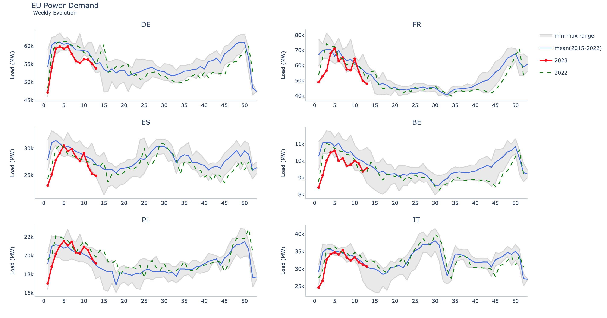

# Following power demand in major EU Economies

You can use this repo to follow the evolution of power demand in EU. The data has been extracted from [ENTSO-E transparency](https://transparency.entsoe.eu/)

ENTSO-E, the European Network of Transmission System Operators for Electricity, is the association for the cooperation of the European transmission system operators (TSOs). The 39 member TSOs representing 35 countries are responsible for the secure and coordinated operation of Europe’s electricity system, the largest interconnected electrical grid in the world.

ENTSO-E data is stored on a local database using [Arctic](https://pypi.org/project/arctic/) - [Link](https://github.com/sinhaashank/entsoe_sftp_data) to the repo

Here is a sample plot - 

## Contributing

Contributions you make are greatly appreciated and always welcome. You can do so by:

1) Forking the github project
2) Creating your feature branch for example: `git checkout -b feature/my-interesting-feature`
3) Commiting your changes using `git commit -m "my-interesting-feature-update"`
4) Pushing to the branch using `git push origin feature/my-interesting-feature`
5) Finally, opening a Pull Request for review

## Discussion

For any other questions or discussions, you can reach out to me via email at `sinha.ashank@gmail.com`.
